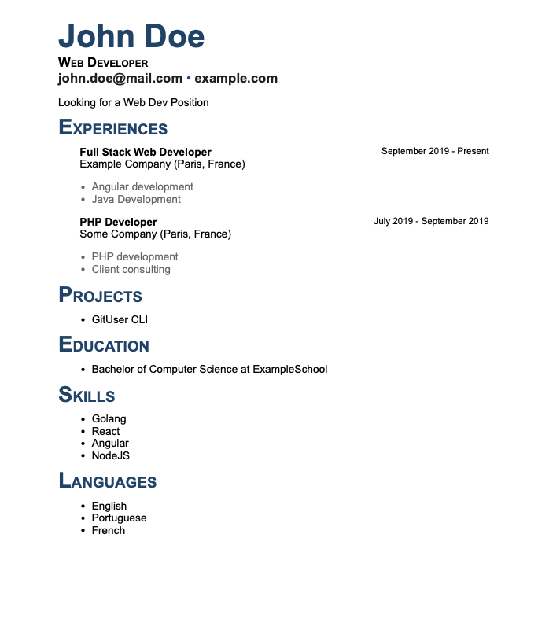

# resume-builder

Build your resume with HTML/CSS and JSON Data

## Local Usage

Enter your data into the `data/resume.json` file.

Run `make output`

Open `output/resume.pdf` or `output/resume.html`

## Api Usage

```
make run
```

request to generate pdf

```
[POST] http://localhost:9000/pdf
```

e.g json data request in [data/resume.json](data/resume.json)

#### Languages

- en
- fr

e.g [data/resume.json](data/resume.json)

```json
"lang": "fr"
```

### Templates

- basic



e.g [data/resume.json](data/resume.json)

```json
  "template": "basic"
```

<hr />

### TODO

- [x] Parse data to Html
- [x] Generate Pdf
- [x] Build an API
- [x] Handle Multiple Languages
- [ ] Build more templates
