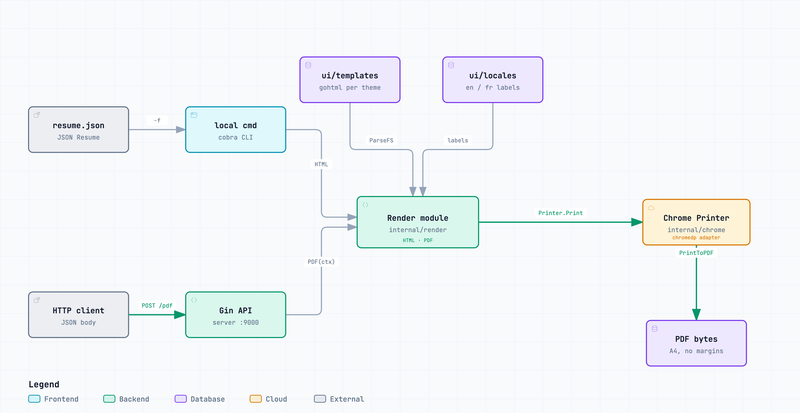

# resb

Build your resume with HTML/CSS and JSON Data. `resb` is short for Resume Builder.

## Table of Contents

- [Introduction](#introduction)
- [Architecture](#architecture)
- [Local Usage](#local-usage)
- [API Usage](#api-usage)
- [Templates](#templates)
- [Skills](#skills)
- [Image](#image)
- [Languages](#languages)
- [Date Formats](#date-formats)
- [Roadmap](#roadmap)
- [How to Contribute](#how-to-contribute)
- [License](#license)

## Introduction

resb is a tool that allows you to generate a resume using HTML/CSS templates and JSON data.
It follows the [JSON Resume](https://jsonresume.org/) standard for structuring resume data.

## Architecture



The `local` command and the API both go through the render module (`internal/render`). It renders the chosen template with labels from `ui/locales`, then headless Chrome prints the page to PDF.

## Local Usage

Create a JSON file with your resume data. You can specify the file path using the `file` flag.

<i>You can see a json file example in [examples/example.resume.json](examples/example.resume.json)</i>

Run the following command to generate the resume in PDF and HTML formats:

```shell
make local file="data/resume.json"
```

Alternatively, you can use the following command:

```shell
go run *.go local -f="data/resume.json"
```

The generated resume files (`resume.pdf` and `resume.html`) will be saved in the `output` directory.

## API Usage

To use resb as an API, follow these steps:

Start the server by running the following command:

```
make server
```

You can also use Docker to run the server:

```
make docker-build
make docker-run
```

Send a POST request to `http://localhost:9000/pdf` with the JSON resume data in the request body.
You can use the example JSON data provided in [examples/example.resume.json](examples/example.resume.json).

The server will generate the resume in PDF format and return it as a response.

e.g example json data request in [examples/example.resume.json](examples/example.resume.json)

## Templates

resb provides the following templates for generating resumes:

- Classic: [Example](examples/example.classic.pdf)
- Basic: [Example](examples/example.basic.pdf)
- Simple: [Example](examples/example.simple.pdf)
- Oldman: [Example](examples/example.oldman.pdf)
- Stackoverflow: [Example](examples/example.stackoverflow.pdf)
- Figacy: [Example](examples/example.figacy.pdf)
- Modern: [Example](examples/example.modern.pdf)

To use a specific template, specify the template name in the JSON resume data:

```json
  "template": "classic"
```

## Skills

A skill can be listed on its own, or used as a category grouping several
technologies through the `keywords` field:

```json
"skills": [
  { "name": "Cloud", "keywords": ["AWS", "Google Cloud", "Azure"] },
  { "name": "Bash/Python" }
]
```

When `keywords` is filled, templates render the name as the category label
followed by its technologies. When it is empty or absent, only the name is
rendered, so existing resume data keeps working unchanged.

## Image

If you want to include an image in your resume, provide the image URL in the JSON resume data:

```json
 "image": "https://i.imgur.com/tHA5l7T.jpg"
```

Upload your image to a service like [imgur](https://imgur.com/) and copy the direct link.

## Languages

resb supports multiple languages for your resume, allowing you to create your resume in a language that suits
your needs. The default language is English (en), but you can choose to use other supported languages as well.

Currently, the following languages are supported:

- English (en)
- French (fr)

This will automatically translate labels such as "Education," "Experiences," and other sections based on the chosen
language.

To set the language for your resume, include the following field in the JSON resume data:
e.g [examples/example.resume.json](examples/example.resume.json)

```json
"lang": "fr"
```

## Date Formats

resb supports the following date formats:

- `2006-01-02` (e.g., "2024-07-09")
- `2006-01` (e.g., "2024-07")
- `January 2 2006` (e.g., "July 9 2024")
- `January 2006` (e.g., "July 2024")
- `2006` (e.g., "2024")

Example of date fields in JSON resume data:

```json
{
  "education": [
    {
      "institution": "University of Example",
      "area": "Computer Science",
      "studyType": "Bachelor",
      "startDate": "2015-09-01",
      "endDate": "2019-06-30"
    }
  ],
  "work": [
    {
      "company": "Example Corp",
      "position": "Software Engineer",
      "startDate": "2020-01",
      "endDate": "2024-07"
    }
  ]
}
```

## Roadmap

- [x] Parse data to HTML
- [x] Generate PDF
- [x] Build an API
- [x] Handle multiple languages (i18n)
- [x] Add tests for rendering, the API and the PDF printer
- [ ] Expand template options
- [ ] Implement automatic translation support

### Versioned CLI

To release, push a version tag: `git tag v0.1.0 && git push origin v0.1.0`. A workflow creates the GitHub release with notes generated from the commits. The steps left before the CLI can be installed and run on its own:

- [x] Release on version tags, with generated release notes
- [x] Module path that `go install` can resolve
- [ ] Embed `ui/` in the binary with `go:embed`, so it runs from any directory
- [x] `version` command, plus `-v` and `--version`
- [ ] Attach macOS and Linux binaries to each release (GoReleaser)
- [ ] Publish the Docker image to GHCR on each release (build it with Go 1.24+ so `version` is stamped, it prints `dev` today)
- [ ] Clear error when Chrome is not installed
- [ ] Document `go install github.com/lucasnevespereira/resb@latest`

Feel free to contribute additional templates and features to enhance resb!

## How to Contribute

If you want to contribute you can read [Contributing](CONTRIBUTING.md)

## License

This project is under [MIT License](LICENSE)
